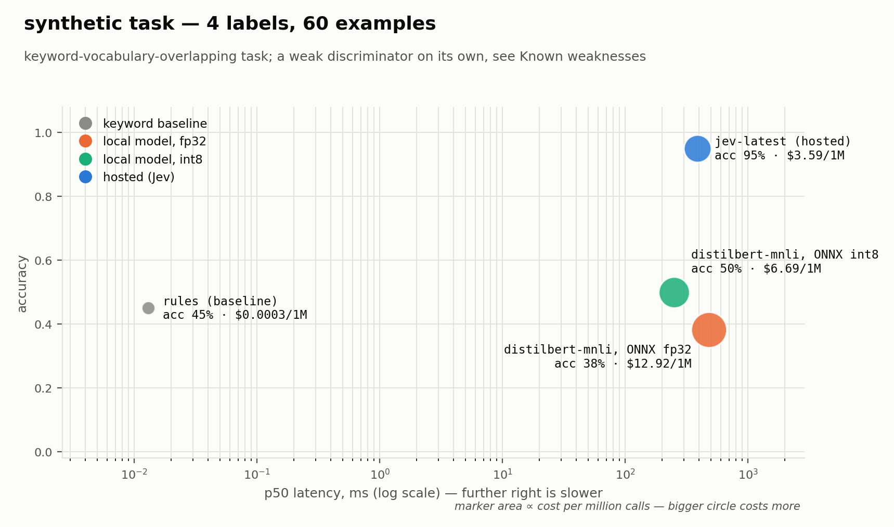
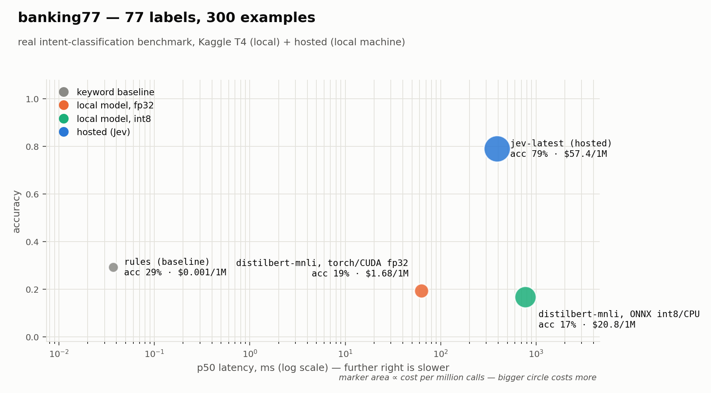

# edgefront JEV

[](https://pypi.org/project/edgefront/)
[](https://github.com/shivpratapsinghpanwar/edgefront/actions/workflows/ci.yml)
[](LICENSE)

Do you need a hosted decision model, or does a small local model match it?
Measure it on your own task instead of guessing.

```bash
pip install edgefront
edgefront bench --task synthetic --backends rules,stub
```

## Why

Hosted "typed decision" models return a label plus calibrated probabilities in
70–500 ms for a fraction of an LLM's price. A quantized classifier on your own
hardware returns the same shape of answer in single-digit milliseconds for
nothing, and works offline.

Which one you should deploy depends on your task, your latency budget and your
volume. This measures all three and prints a verdict.

## What it does

Runs the same examples, the same label space and the same wording through every
backend, then reports accuracy, calibration error, the latency distribution and
cost per million calls.

## Tasks

A task is a label space, an instruction string, and a list of labelled examples
— see `edgefront.types.TaskSpec`. Two ship with the package:

| task | labels | examples | source | what it's for |
|---|---:|---:|---|---|
| `synthetic` | 4 | up to 200, generated | rule-based templates, no download | exercises the whole pipeline offline in CI — **not a model discriminator**, see Known weaknesses |
| `banking77` | 77 | up to ~3,000, `test` split | [`legacy-datasets/banking77`](https://huggingface.co/datasets/legacy-datasets/banking77) (HF parquet mirror of PolyAI's banking-intent set) | a real, hard, fine-grained intent-classification benchmark |

`edgefront tasks` lists both from the CLI. Add your own by writing a
`TaskSpec` loader — `src/edgefront/tasks/synthetic.py` is the template, and
`src/edgefront/tasks/banking77.py` shows how to wrap a HuggingFace dataset.
**Your own labelled data is what actually answers the question this tool
asks** — the two bundled tasks exist so the pipeline has something to run
against out of the box, not as a substitute for benchmarking your task.

## Models compared

Every result below asks the identical zero-shot question, worded identically,
of four backends:

| backend | what it is | how it decides |
|---|---|---|
| `rules` | no model — keyword-overlap baseline | counts words shared with each label's description |
| local, fp32 | [`typeform/distilbert-base-uncased-mnli`](https://huggingface.co/typeform/distilbert-base-uncased-mnli), 67M params, run via torch or ONNX Runtime at full precision | zero-shot NLI: scores `"This text is about {label}."` as an entailment hypothesis per label, softmaxes the entailment logits |
| local, int8 | the same checkpoint, dynamically quantized to INT8 via `onnxruntime.quantization` | identical method, quantized weights |
| `jev` (hosted) | TypeSafe's `jev-latest` | a `Choice` question over the label set, called through `typesafe-sdk` |

The local backend is zero-shot on purpose, not fine-tuned — see **Known
weaknesses** for why, and what a fine-tuned classifier would change.

## Results

### `synthetic` — 4 labels, 60 examples, Windows CPU, called from India



| backend | acc | ECE | p50 ms | p99 ms | $/1M | offline |
|---|---:|---:|---:|---:|---:|:--:|
| rules | 0.450 | 0.099 | 0.013 | 0.368 | 0.0003 | yes |
| distilbert-mnli, ONNX fp32 | 0.383 | 0.165 | 481 | 3911 | 12.9 | yes |
| distilbert-mnli, ONNX int8 | 0.500 | 0.284 | 249 | 523 | 6.69 | yes |
| jev-latest (hosted) | 0.950 | 0.036 | 386 | 557 | 3.59 | no |

**The hosted model wins, decisively — by 45 points — and it is also better
calibrated and cheaper.** This is the opposite of the project's original
hypothesis, and it is the finding, not an embarrassment to bury: the local
zero-shot NLI approach scores one entailment hypothesis per label, so it pays
for a full forward pass *per label, per example*. On this 4-label task that is
already 4x the inference cost of one hosted call; the hosted model answers all
labels in a single request. Quantizing the local model to INT8 clawed back
some of that but did not close a 45-point accuracy gap, and paying
per-forward-pass cost on a worse model is not a trade worth making.

### `banking77` — 77 labels, 300 examples, torch/CUDA on a Kaggle T4 + hosted locally



| backend | acc | ECE | p50 ms | p99 ms | $/1M | offline |
|---|---:|---:|---:|---:|---:|:--:|
| rules | 0.293 | 0.218 | 0.037 | 0.074 | 0.001 | yes |
| distilbert-mnli, torch/CUDA fp32 | 0.193 | 0.128 | 62.7 | 122 | 1.68 | yes |
| distilbert-mnli, ONNX int8/CPU | 0.167 | 0.126 | 774 | 1721 | 20.8 | yes |
| jev-latest (hosted) | 0.790 | 0.108 | 391 | 556 | 57.4 | no |

**Hosted leads by 59.7 points here — a bigger gap than on the toy task, exactly
as the label-count theory predicts.** The uncomfortable part, reported as
measured: **both local backends score below the keyword baseline.**
Zero-shot NLI does badly telling apart fine-grained, closely worded intents
(`card_swallowed` vs. `lost_or_stolen_card`) — worse, on this run, than
matching plausible keywords. On cost per call local is still cheaper in
isolation (the local cost model amortises hardware you already own), but a
59.7-point accuracy gap is the actual argument against it here, not price.
Produced by `kaggle_job/run_banking77.py` (real Kaggle T4 run) merged with a
local `jev` run via `edgefront merge` — see `kaggle_job/README.md`.

### Three things worth carrying forward honestly

1. **The vendor's published 70-500 ms latency does not hold from this network
   position.** Measured p50 386 ms on the toy task, p99 557 ms (p99 hit
   1254 ms on an earlier run). Hosted latency is a function of where you call
   it from, not just the model — `environment()` records host and UTC time in
   every result document so this doesn't get generalized past the network it
   was measured on.
2. **INT8 beat FP32 on speed and size every time it was measured**, and
   matched or beat it on accuracy on the toy task (0.500 vs 0.383 — on 60
   examples that gap is noise, but the ~2x latency improvement and the 4.0x
   smaller checkpoint are real and repeatable: 267.9 MB → 67.3 MB). There was
   no accuracy tax for quantizing dynamically, at least here.
3. **Local cost and accuracy both scale badly with label count.** The local
   backend is one forward pass per label; the hosted backend is not. Going
   from 4 labels to 77, local p50 latency went from milliseconds to
   hundreds-to-thousands of milliseconds, and local accuracy fell to *below*
   the keyword baseline. This is why the banking77 run needed a GPU at all
   (roughly 19 s/example on a laptop CPU at 77 labels) — see `kaggle_job/`.

Both result documents (`bench_full.json`, and the merged banking77 run) and
their generated `BENCH.md`-style reports are what the tables above are
transcribed from — nothing here is hand-typed and then left to drift; see
`docs/make_charts.py` for exactly how the charts are drawn from those numbers.

## Design rules

These are the parts that decide whether a benchmark is worth reading:

- **A keyword baseline runs by default.** If a frontier model is only a few
  points above keyword matching, that is the most important number on the page,
  and a benchmark without a floor hides it.
- **Latency is a distribution, never a mean.** p50/p90/p99/max. A mean hides the
  tail, and the tail is what breaks a real-time budget.
- **The first 3 calls per backend are discarded** as warmup.
- **Backends run sequentially** so they cannot contend for CPU and corrupt each
  other's timings.
- **A failed call counts as wrong, not as missing.** A backend that errors on
  10% of inputs is not accurate on the rest.
- **Cost assumptions are printed next to the cost.** Local cost is amortised
  hardware plus power, which is arguable, so the arithmetic is shown.
- **The comparison is zero-shot on both sides.** A hosted model has not seen
  your labels, so the local contender is scored zero-shot too via NLI
  entailment. A fine-tuned classifier would win while answering a different
  question.

## Known weaknesses

Said plainly, because a benchmark that hides its own weak points is worse than
no benchmark:

- **The bundled `synthetic` task is generated from templates that share
  vocabulary with the label descriptions**, so a keyword baseline does
  unusually well on it (0.450 accuracy above, competitive with the local
  models). It exists to exercise the pipeline offline in CI, not to rank
  models — it is not a good discriminator, and the numbers above should not be
  read as "keyword matching nearly beats a neural model in general."
- **The local contender is zero-shot NLI, not a fine-tuned classifier**, chosen
  because the hosted model is also zero-shot and the comparison has to hold
  that variable constant. A task-specific fine-tune of the same small model
  would very likely score far higher than either backend above. That is a
  legitimate objection to this benchmark's framing, not one to hide: if you can
  afford to fine-tune on your own labels, do that comparison instead — this
  tool answers "zero-shot local vs. zero-shot hosted," not "the best local
  model you could build vs. hosted."
- **Question wording is an experimental variable, not a constant.** The
  hypothesis template (`"This text is about {}."`) and the task's `criteria`
  wording both affect both backends, but not necessarily equally — TypeSafe's
  own guidance says agents write poor questions on the first pass and expect to
  refine them collaboratively. Bad wording here would unfairly penalize the
  hosted model, which is one more reason to rerun this on your own task and
  wording rather than trust the numbers above at face value.

## Usage

```bash
edgefront tasks                     # list decision tasks
edgefront bench --task synthetic --backends rules,stub --json out.json
edgefront report out.json --out BENCH.md
edgefront verify out.json --min-acc 0.85 --max-p99 50
edgefront merge run_a.json run_b.json --json merged.json  # combine runs from different machines
```

`verify` exits 1 when a threshold is missed, so it drops straight into CI.
`merge` combines `bench` result documents produced on different machines into
one document with a single recomputed frontier and verdict — for example, a
local backend benchmarked on a GPU where there is no hosted-model API key,
plus a hosted backend benchmarked wherever that key lives (see
`kaggle_job/`). It refuses to merge documents that ran a different number of
examples, or that both contain the same backend name, since either would make
the resulting gap meaningless rather than just imprecise.

### Backends

| token | what it is | needs |
|---|---|---|
| `rules` | keyword overlap baseline | nothing |
| `stub` | deterministic fake, for tests | nothing |
| `hf[:model-id]` | local zero-shot NLI classifier, torch | `edgefront[local]` |
| `onnx:<file>:<tokenizer>[:precision]` | local zero-shot NLI, ONNX Runtime (fp32/int8) | `edgefront[local]` |
| `jev` | TypeSafe Jev, hosted | `edgefront[jev]` + `TYPESAFE_API_KEY` |

`hf` and `onnx` default to
[`typeform/distilbert-base-uncased-mnli`](https://huggingface.co/typeform/distilbert-base-uncased-mnli)
if no model id is given — the checkpoint used for every local result above —
but take any HuggingFace sequence-classification (NLI) checkpoint. `jev`
defaults to TypeSafe's `jev-latest`. See **Models compared** above for what
each one actually is.

`edgefront.quantize` exports an HF checkpoint to ONNX and quantizes it to
dynamic INT8 (`export_onnx`, `quantize_int8`) so you can produce the
`onnx:model.onnx:tokenizer-id` and `onnx:model.int8.onnx:tokenizer-id:int8`
backends above from any HF sequence-classification checkpoint.

Adding a backend means implementing two methods — `predict()` and `meta()`.
See `src/edgefront/backends/stub.py`; it is the whole contract.

### Install

```bash
pip install edgefront            # core: stdlib only, runs bench/report/verify/merge
pip install 'edgefront[local]'   # local models (torch, onnxruntime, transformers)
pip install 'edgefront[jev]'     # hosted backend (typesafe-sdk)
pip install 'edgefront[tasks]'   # banking77 and other HF-dataset-backed tasks
pip install 'edgefront[plot]'    # regenerate docs/charts/*.png
pip install 'edgefront[all]'
```

The core install has no dependencies, so `report`, `verify` and `merge` run
anywhere, including in CI with no model and no network.

## Status

The core question now has a published answer on two tasks (see Results
above): hosted beats local zero-shot NLI by 45 points on a toy 4-label task
and by 59.7 points on the real 77-label banking77 benchmark, and is better
calibrated on both. All backends work — `rules`, `stub`, `hf`, `onnx` (fp32
and int8), `jev` — along with HF→ONNX→INT8 export (`edgefront.quantize`),
merging multi-machine runs (`edgefront merge`), and a Kaggle job for
label-heavy tasks that don't fit on a laptop CPU (`kaggle_job/`).

Next: render the per-bucket calibration reliability curve that's already in
every result JSON (`meta.reliability_curve`) into the markdown report, and a
third task with a different shape (not intent classification) to check the
label-count finding isn't an artifact of NLI specifically.

## License

MIT
